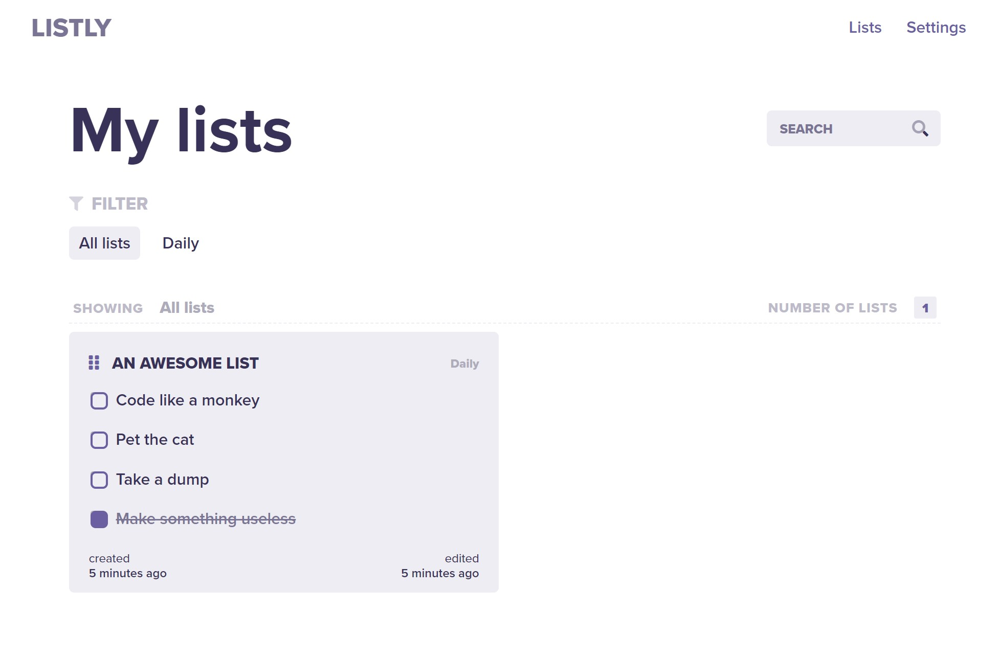

<hr>

# ✔ Wohoo another todo app! 
(*whispers: built with love from France*🌹)
(*whispers: just kidding, comming to you from the cold forests of sweden*)

Welcome to my personal project. The most cliché idea yet! Building a todo application in vue! Wow, you must be thinking: What a creative guy! Well thank you for your thoughts. Looks can be deceiving, my guy. The idea is, however, to build a professional, releasable, cool and clean looking To-do application using Vue, Vuex and lots of other stuff. Probably... 

So just enjoy, fork it, or just criteque my code in a good ol' issue.

## 💡 Attention!
I've just given this some love! Multiple-List, the branch that has been 5 months in the making is finally merged. My god this was an amazing journey.. I wanna start of by thanking my mom.... just kidding. Been busy, nothing less, nothing more. 

BUT! This means that new features have arose! Check the list below the Comming up in v.2 to see what features are done!

👋 okthanksbye


## 🤺 FEATURES
* Have a wonderful todo list
* Drag and drop sorting dude! (wooaaahh)
* Mark those todos as done
* Remove the todos you hate
* Add more todos that you love
* Save those fu&#!ers in tha browser, my guy!
* Check out my fancy info animation

That's it for version 1. 

Luckily for you, I've started v.2. And it is massive... Here are some goodies planned for version 2:

## 🤳 COMMING UP IN V.2
* ~Create and save lists in plural! (🎉Yay!)~
* ~Make use of lovely filters when you are lazy~
* Search for your little biscuts (read: todos) when in dire need of sweets (read: a task? idunno..)
* ~Relax when whatching your todos float seamlessly sorrounded by a renovated design language! (such fancy words)~
* Edit settings saved in tha browser, like.. something useful!
* Them....

Okay, gotta stop myself there before I promise you the world, you beutiful beast!

In the mean time! Go and try it! 

Live version should be on https://vue-todo.brorarmand.com/. Let me know If you've got any feedback at all! 🎂

## If you wanna try it

```
git clone https://github.com/fabifors/vue-todo
yarn install
```

### If you wanna serve it

```
yarn run serve
```

### If you wanna build it
```
yarn run build
```

### If you wanna tes...
```
yarn run -i dont/have/any --tests
```

### If you wanna lint
```
yarn run lint
```
*lint and fix*
```
yarn run lint --fix
```
